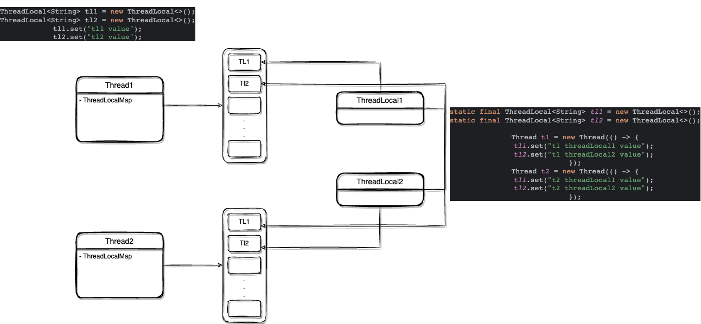

## 简单实现及其弊端

初看 ThreadLocal 实现，会觉得其很别扭、难以理解。为什么不直接在 ThreadLocal 类中维护一个 ConcurrentHashMap<Thread, Object>，各个线程以自己为键获取对应的值呢。

**第一个问题：对象可能不会被回收**

如果以上面的方式实现，那在线程结束时则需要手动将 ConcurrentHashMap 中的键值对进行删除，才可以帮助 Thread 和我们存储的值进行回收。

或许我们可以使用 WeakReference 类辅助线程回收，当线程结束执行后并且脱离作用范围时，弱引用的 Thread 会被垃圾回收器回收。

但这会又有一个问题，当线程执行完毕后但是其对象仍被用户持有，则其和对应的值一直不会被回收。

在 ThreadLocal 的实现中，以上问题都可以被解决。你只需要注意在线程运行过程中，及时清除创建的 ThreadLocal 中的值（使用 ThreadLocal.remove），就可以避免内存泄漏。

  

**第二个问题：并发问题**

即使使用了 ConcurrentHashMap 等 JUC 并发类，但在实现过程中还是可能会出现线程安全问题。另外多线程并发访问时，难免出现线程冲突造成效率下降的情况。

而通过 Thread 维护一份私有属性 ThreadLocalMap，并确保只有当前线程才可以修改它，这就完全避免了线程安全的问题，并且这是无锁化的实现。优雅简洁的兼顾了线程安全以及效率的问题。

## 示意图

ThreadLocal 和 Thread 之间的关系如下：


Thread 内部维护一个 ThreadLocalMap，其键为 ThreadLocal 类型，值为调用者想存储的类型。当创建多个 ThreadLocal 时，ThreadLocal 以自身为 key 到 Thread.ThreadLocalMap 中取出对应的值。

ThreadLocal 也可以同时在多个 Thread.ThreadLocalMap 中作为键存储值，由于 ThreadLocalMap 存储在不同 Thread 内部，所以即使键一样，也可以隔离各个线程间的存储值。

## 验证代码
### 线程对应多个 ThreadLocal

``` java
ThreadLocal<String> tl1 = new ThreadLocal<>();  
ThreadLocal<String> tl2 = new ThreadLocal<>();  
tl1.set("tl1 value");  
tl2.set("tl2 value");
```

当对上述代码进行调试时，可以发现当前线程的 ThreadLocalMap 中有两个键，分别对应这 tl1、tl2，值分别为 `tl1 value` 和 `tl2 value`

### ThreadLocal 对应多个线程

```java
static final ThreadLocal<String> tl1 = new ThreadLocal<>();   
  
static Thread t1 = new Thread(() -> {  
    tl1.set("t1 value");  
    try {  
        Thread.sleep(10000);  
    } catch (InterruptedException e) {  
        throw new RuntimeException(e);  
    }  
});  
static Thread t2 = new Thread(() -> {  
    tl1.set("t2 value");  
    try {  
        Thread.sleep(10000);  
    } catch (InterruptedException e) {  
        throw new RuntimeException(e);  
    }  
});
```

对上述代码进行调试时，可以发现 t1、t2 线程中的 ThreadLocalMap 中的键都为 tl1，但其对应的值则分别为 `t1 value`、`t2 value`

## 回收时机

### Thread

当线程执行完毕（即内部 Runnable、Callable 代码执行结束）时，Thread 内部属性会被回收，Thread 对象在脱离作用域后会被回收

### ThreadLocalMap

- ThreadLocalMap 随着线程执行完毕会被回收
```java
private void exit() {  
    if (threadLocals != null && TerminatingThreadLocal.REGISTRY.isPresent()) {  
        TerminatingThreadLocal.threadTerminated();  
    }  
    if (group != null) {  
        group.threadTerminated(this);  
        group = null;  
    }  
    /* Aggressively null out all reference fields: see bug 4006245 */  
    target = null;  
    /* Speed the release of some of these resources */  
    threadLocals = null;  
    inheritableThreadLocals = null;  
    inheritedAccessControlContext = null;  
    blocker = null;  
    uncaughtExceptionHandler = null;  
}
```
- ThreadLocalMap 中的键值对（Entry<ThreadLocal, Object>）会在调用 ThreadLocal.remove 方法被释放回收

### ThreadLocal

ThreadLocal 在脱离作用域后会被回收。作为类静态变量时，项目关闭后 ThreadLocal 会被回收。作为对象属性时或者局部变量时，在对象回收或退出作用域后，ThreadLocal 会被回收。


参考资料:
- https://stackoverflow.com/questions/1202444/how-is-javas-threadlocal-implemented-under-the-hood