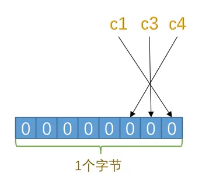
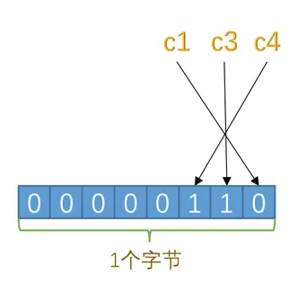
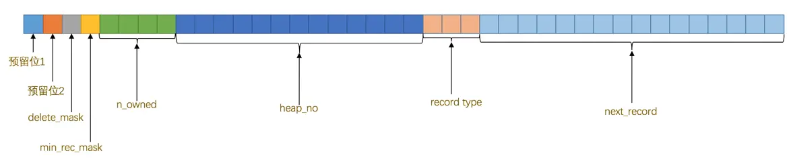
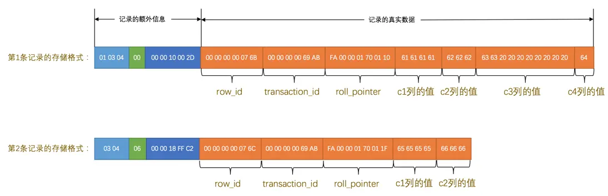
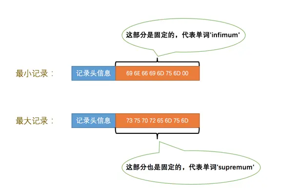
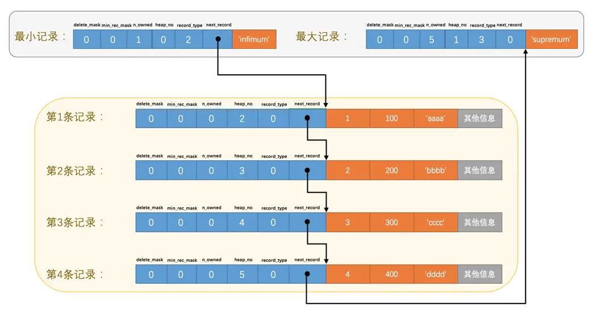
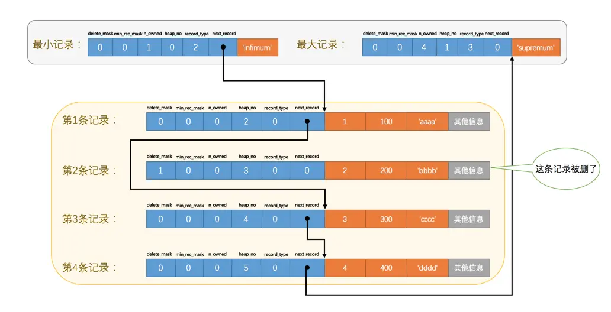
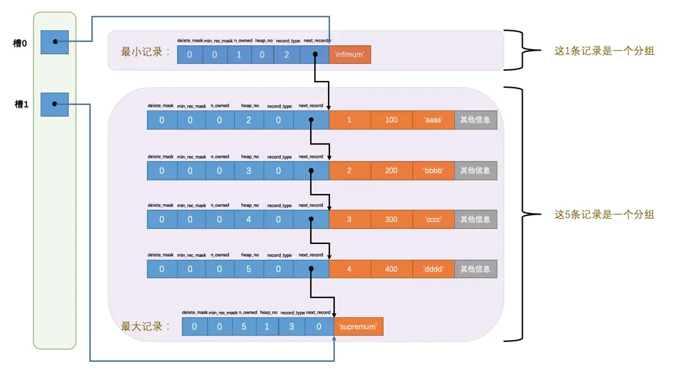

> 本文主要简单讲述 MySQL InnoDB 引擎的行记录、数据页文件结构
> 
> MySQL Version：5.6
> Storage engine：InnoDB

## 最简单的数据库实现 

``` shell
#!/bin/bash
 
DATABASE_FILE=.database
 
function db_clear() {
  rm -f "$DATABASE_FILE"
}
 
function db_set() {
  echo "$1,$2" >> "$DATABASE_FILE"
}
 
function db_get() {
  grep "^$1," "$DATABASE_FILE" | sed -e "s/^$1,//" | tail -n 1
}

# usage

db_set name helloacm
db_set age 20
 
# name=helloacm
echo name=$(db_get name)
# age=20
echo age=$(db_get age) 
# 404=
echo 404=$(db_get 404)
 
echo DATBASE contents
# name,helloacm 
# age,20
```

上述是使用 `shell` 实现的一个程序，其实现了基本的数据库的写入、读取的功能。虽然其阐释了一个本质：数据库无非是一个可以将数据写入文件持久化保存，并支持从文件中读取之前已保存的数据的程序。但由于其简单的文件组织形式，其远远不能胜任生产使用。

当前的文件组织形式有以下缺点：
- 只能支持 key-value 形式的存储形式，不支持多列的数据
- 查询效率低，无论查询哪条记录，都需要扫描整个文件（即使它在第一行）
- 不支持记录的删除
- ...

由此我们可以看到，文件组织形式对于数据存储型程序来说，犹如基石一般。设计良好的文件格式，不仅能提升应用效率和可维护性，还能降低应用开发成本、后期维护成本以及学习成本等。

## 自己设计简单的表记录文件

MySQL InnoDB 存储引擎中的文件众多，如果只是单纯的介绍各种类型的文件，极有可能如背八股文一般，既枯燥又让人莫名其妙。下面我们将通过若干个小的需求点来尝试自己设计一个支持 CRUD 的数据库文件，以窥探 MySQL InnoDB 存储引擎设计者的良苦用心。

如果让你来设计一种文件格式，其可以支持数据的 CRUD（比如下面的 `record_format_demo` 表），你会如何开始？
``` sql
CREATE TABLE record_format_demo ( 
	c1 VARCHAR(10),
	c2 VARCHAR(10) NOT NULL,
	c3 CHAR(10), 
	c4 VARCHAR(10)
) CHARSET=ascii ROW_FORMAT=COMPACT;
```

首先，长舒一口气，放轻松，没有人会用你设计和编写的代码，你不用对任何人负责，所以不用担心，让我们一步一步的尽可能设计出一个支持数据 CRUD 的文件格式。

### 行记录

如同上所述 shell 程序使用的 key-value 格式，如果需要支持多个列的记录格式，我们第一想法就是多个列数据从左至右依次写入：
```
INSERT INTO record_format_demo(c1, c2, c3, c4) VALUES('aaaa', 'bbb', 'cc', 'd')

---------------------
| c1 | c2 | c3 | c4 |
---------------------
```

但这有一个问题，由于数据库不仅支持定长的字段（如：int、date、char），也支持变长的字段（如：varchar、text、blob），如果按上面的组织形式的话，我们无法区分各个列的数据。为了区分列数据，我们有以下一些想法：

- 各个列数据之间使用特定二进制序列隔开，如同使用 `\n` 代表对行之间进行分割。但这有个问题，无论使用什么二进制序列进行分割，都可能和用户数据混淆，从而导致数据读取错误
- 各个列数据都以 4 * N 个字节存储，如果不足 4 * N 个字节，则左侧使用 0 进行填充。这也会存在上面的问题，你无法判断列数据左侧的 0 是用户数据还是填充数据。另外就是这会造成大量的空间浪费（及时存储 1 个字节的字符数据也需要至少 4 个字节空间）
- 在每条记录数据空间之外使用额外空间用于存储字段内容长度（如下图）。首先我们读取该数据以获悉字段值的长度，然后分别读取对应区间的数据，即可获取对应字段值。该方法看起来可行，至少不会造成数据的混淆。
```
INSERT INTO record_format_demo(c1, c2, c3, c4) VALUES('aaaa', 'bbb', 'cc', 'd')

------------------------------------------------
| c1.len | c2.len | c4.len | c1 | c2 | c3 | c4 |
------------------------------------------------
|                          |                   |
|    变长字段长度列表         |        字段值      |
```

#### 变长字段长度列表

如上 `record_format_demo` 表中除去 c3 列，其他列都是变长字段，我们尝试使用额外的数据来记录 c1、c2、c3 字段值的长度。
##### 使用多大空间来记录字段值长度的值？

假设一个字段的定义为 `varchar(50)`，则其字段长度区间为 0~50，我们只需要 1 个字节就可以记录这个区间。
假设一个字段的定义为 `varchar(65535)`，则其字段长度区间为 0~65535，这个时候需要 1 或 2 个字节来记录。

##### 如何区分字段长度数据？

第一种方式，计算出所有字段值长度记录所需的最大字节数，然后每个字段值长度都以这个长度的空间进行记录。比如最长的字段长度需要 2 个字节来记录，则每个字段长度都使用两个字节来记录（不足的空间左侧使用 0 填充）。

第二种方式，每个字段长度使用的字节数按需分配，字段长度小的使用 1 个字节存储，大的使用 2 个字节存储。每个字节的第一个二进制位是否为 0 来标识当前字节是否是完整的字段长度。

#### NULL 值列表

由于字段支持 NULL 值，如果将 NULL 值以特殊形式（如：`0x78857676`，即 NULL）存储在数据空间，则会出现以下一些问题：
- 可能与用户数据 `NULL` 混淆
- 破坏了变长字段长度列表设计，是应该记录该字段长度为 4 还是 0 呢？
- 空间利用率差，使用了 4 个字节来表示 NULL 

既然在数据内容中存储 NULL 不行，可不可以如同变长字段长度列表一样，申请单独的一块空间用于记录哪个字段值为 NULL。
```
INSERT INTO record_format_demo(c1, c2, c3, c4) VALUES('aaaa', 'bbb', NULL, NULL)

-----------------------------------------
| c1.len | c2.len | 0 | 1 | 1 | c1 | c2 |
-----------------------------------------
|                 |           |          |
| 变长字段长度列表   |NULL 值列表 | 字段值    |
```

由于 c1、c3、c4 字段可能为 NULL，所以 NULL 值列表只有 3 个二进制位用以表示对应 3 个字段的 NULL 值情况。为 0 代表非 NULL，为 1 代表为 NULL。

#### 删除标志

用户数据不是日志，既然支持插入就允许删除。

最简单的删除办法即物理删除，当删除一条记录时，计算出该记录在文件系统中的偏移量和长度，然后删除该记录并且将后续的记录移动，以填充被删除记录的碎片空间。这会调用多次磁盘操作，导致删除操作较为耗时。

还有另一种办法，即先将该记录标记为已删除，然后在若干时间后，批量将已被删除的记录所占用的空间进行物理擦除，并调整剩余有效记录位置。这种方法可以有效降低单次删除操作所需的时间。

为此我们需要一个额外空间来记录当前记录是否被删除，我们可以使用单独的空间或者是在记录空间上单独申请一个二进制位用来记录，为了方便维护和实现，我们选择后者。

```
INSERT INTO record_format_demo(c1, c2, c3, c4) VALUES('aaaa', 'bbb', NULL, NULL);
DELETE FROM record_format_demo WHERE c1 = 'aaaa';

--------------------------------------------------
| c1.len | c2.len | 0 | 1 | 1 |   1    | c1 | c2 |
--------------------------------------------------
|                 |           |         |        |
| 变长字段长度列表   |NULL 值列表 | 删除标识 | 字段值  |
```

至此，我们终于设计出支持变长字段、支持 NULL 值、支持删除的记录格式。
### 数据文件

当一个表数据存在多条记录时，记录之间改如何组织呢？


从 DDL 开始说起：

增加
- 字段是可以变长的（变长类型的编码集）
- 字段可以为 null
- 字段过长时的分散存储
- 数据内容存储
修改
- 变短
- 变长
删除
- 数据记录的删除
查找
- 数据页中的记录检索，跳表二分查找
- 数据页之间的串联

## 行记录结构

创建示例表结构：
``` sql
CREATE TABLE record_format_demo ( 
	c1 VARCHAR(10),
	c2 VARCHAR(10) NOT NULL,
	c3 CHAR(10), 
	c4 VARCHAR(10)
) CHARSET=ascii ROW_FORMAT=COMPACT;
```

写入两条数据：
``` sql
INSERT INTO record_format_demo(c1, c2, c3, c4) VALUES
('aaaa', 'bbb', 'cc', 'd'), 
('eeee', 'fff', NULL, NULL);
```

InnoDB 引擎中有 `Compact`、`Redundant`、`Dynamic`、`Compressing` 四种行格式。其中 `Redunant` 行格式是 `MySQL5.0` 之前用的一种行格式，`Dynamic` 、`Compressing` 是 `Compact` 格式基础上进行一些改进的格式。故本章主要以 `Compact` 行格式进行讲解。

### Compact 行格式


#### 变长字段长度列表

**什么字段会被存储字段内容长度？**

通过 `varchar(M)`、`varbinary(M)`、`Text`、`Blob` 格式定义的字段。或者使用变长字符集（如 `UTF8`）的 `char(M)`字段。

**使用多少个字节用来存储字段内容长度？**

字段能存储的最大长度（M * N） =  字段定义长度 M（`varchar(M)`）* 字符集最大字节数 N（比如 UTF8 为 1~3 字节长度，最大字节数为 3）
字段实际存储的长度  = L

- 当 M * N <= 255，使用 1 个字节存储字段内容占用的字符数
- 当 M * N > 255，且 L <= 127 时，使用 1 字节表示字段内容占用的字符数
- 当 M * N > 255，却 L > 127 时，使用 2 字节表示字段内容占用的字符数

注意：
1. 当 M * N > 255 时，该字段长度长度的字节中第一个为 0 时，代表该字节为单独字段内容长度，为 1 时，代表该字节与前一个字节共同表示字段内容长度
2. 因为字符字段最大长度为 65535（2 ^ 16）字节，但是一般数据页长度为 16KB （2 ^ 12），所以当字段长度大于一定字节数时，会将部分数据存储在另一个数据页中，此时保留在当前页上的数据内容长度使用 2 个字节足够记录

#TODO 增加实际记录的二进制数据截图
#TODO 变长字符集的存储形式
#### NULL 值列表

只有可以存储 NULL 值的列才会被统计到 NULL 值列表中。每个允许存储 NULL 值的列对应一个二进制位：
- 二进制位的值为 1 时，代表该列的值为 NULL
- 二进制位的值为 0 时，代表该列的值不为 NULL

NULL 值列表必须用整数个字节位表示，如果二进制位个数不为整个字节，则在高位补 0。

上述示例行记录的 NULL 值列表效果图如下：

`c1`、`c3`、`c4`这3个列的值都不为`NULL`


`c1`、`c3`、`c4`这3个列中`c3`和`c4`的值都为`NULL`

#TODO 增加实际记录的二进制数据截图

#### 记录头信息

另一个描述记录的记录头信息由固定的 5 个字节组成，不同的二进制位表示不同的意思，具体如下：

|名称|大小（单位：bit）|描述|
|:-:|:-:|:-:|
|`预留位1`|`1`|没有使用|
|`预留位2`|`1`|没有使用|
|`delete_mask`|`1`|标记该记录是否被删除|
|`min_rec_mask`|`1`|B+树的每层非叶子节点中的最小记录都会添加该标记|
|`n_owned`|`4`|表示当前记录拥有的记录数|
|`heap_no`|`13`|表示当前记录在记录堆的位置信息|
|`record_type`|`3`|表示当前记录的类型，`0`表示普通记录，`1`表示B+树非叶子节点记录，`2`表示最小记录，`3`表示最大记录|
|`next_record`|`16`|表示下一条记录的相对位置|


#### 真实数据

在一般表记录中，除了真实数据之外，MySQL 会为每个记录默认的添加一些列，具体如下：

|列名|是否必须|占用空间|描述|
|:-:|:-:|:-:|:-:|
|`DB_ROW_ID`|否|`6`字节|行ID，唯一标识一条记录|
|`DB_TRX_ID`|是|`6`字节|事务ID|
|`DB_ROLL_PTR`|是|`7`字节|回滚指针|

当表中有用户自定义的主键或者建立 `Unique` 索引的键，则 InnoDB 将以此为主键。如果没有，则添加一个 `DB_ROW_ID` 隐藏列作为主键。

上述的示例行数据结构图如下：


- 第一条记录的 `c3` 字段虽然内容仅占 2 个字节（'cc'），但因为其实固定长度，所以使用空白符（0x20）将剩余的 8 个字节进行填充
- 第二条记录的 `c3`、`c4` 列值为 NULL，其被存储于前边的 NULL 值列表处，故在真实数据处不再冗余存储

## 数据页结构

页是`InnoDB`管理存储空间的基本单位，一个页的大小一般是`16KB`。`InnoDB`为了不同的目的而设计了许多种不同类型的`页`，比如存放表空间头部信息的页，存放`Insert Buffer`信息的页，存放`INODE`信息的页，存放`undo`日志信息的页等。本章我们主要讲述数据页。页的基本结构如下：


|   |   |   |   |
|:-:|:-:|:-:|:-:|
|`File Header`|文件头部|`38`字节|页的一些通用信息|
|`Page Header`|页面头部|`56`字节|数据页专有的一些信息|
|`Infimum + Supremum`|最小记录和最大记录|`26`字节|两个虚拟的行记录|
|`User Records`|用户记录|不确定|实际存储的行记录内容|
|`Free Space`|空闲空间|不确定|页中尚未使用的空间|
|`Page Directory`|页面目录|不确定|页中的某些记录的相对位置|
|`File Trailer`|文件尾部|`8`字节|校验页是否完整|

### 记录在页中的存储

让我们再次回顾行数据的记录头信息，`delete_mask`、`min_rec_mask`、`n_owned`、`heap_no` 其中这 4 个属性与记录在数据页上的存储格式相关。我们在下文详细介绍：

#### delete_mask

在行数据的记录头信息中有一位 `delete_mask` 字段，该字段为 1 时代表数据已被删除，为 0 时则代表未被删除。这就意味着记录被删除后并不会立即从磁盘上清除，从而减少删除时记录重新排列时的性能消耗。
#### min_rec_mask

B+树的每层非叶子节点中的最小记录都会添加该标记，该值为 1 则代表该记录为 B+ 树非叶子节点中的最小记录。
#### heap_no

这个属性表示当前记录在本`页`中的位置。InnoDB 设计者在每个页里加上两个记录（该记录不是用户插入的实际数据），一个代表`最小记录`（比页中所有用户记录主键值都小，heap_no 为 0），一个代表`最大记录`（比页中所有用户记录主键值都大，heap 为 n + 1）。

这两条记录的构造十分简单，都是由5字节大小的`记录头信息`和8字节大小的一个固定的部分组成的。如下图：



由于这两条记录不是我们自己定义的记录，所以它们并不存放在`页`的`User Records`部分，他们被单独放在一个称为`Infimum + Supremum`的部分。
#### record_type

这个属性表示当前记录的类型，一共有4种类型的记录，`0`表示普通记录，`1`表示B+树非叶节点记录，`2`表示最小记录，`3`表示最大记录。
#### next_record

表示从当前记录的真实数据到下一条记录的真实数据的地址偏移量。比方说第一条记录的`next_record`值为`32`，意味着从第一条记录的真实数据的地址处向后找`32`个字节便是下一条记录的真实数据。通过这种方式组成了记录的`链表`，可以通过一条记录找到它的下一条记录。

规定 _**Infimum记录（也就是最小记录）**_ 的下一条记录就是本页中主键值最小的用户记录，而本页中主键值最大的用户记录的下一条记录就是 _**Supremum记录（也就是最大记录）**_(`最大记录`的`next_record`的值为`0`，这也就是说最大记录是没有`下一条记录`)


当记录发生删除后，链表会发生对应的变化。


#### n_owned

下文介绍。

### Page Directory

现在记录在页中按照主键由小到大串联成一个单链表，如果根据主键查询对应的记录呢？

最笨的办法：从`Infimum`记录（最小记录）开始，沿着链表一直往后找，最终会找到或没找到。但当页中的记录较多时，此查询性能是较差的。

使用二分查找的方式进行记录查询：
1. 将所有正常的记录（包括最大和最小记录，不包括标记为已删除的记录）划分为几个组。
2. 每个组的最后一条记录（也就是组内最大的那条记录）的头信息中的`n_owned`属性表示该记录拥有多少条记录，也就是该组内共有几条记录。
3. 将每个组的最后一条记录的地址偏移量单独提取出来按顺序存储到靠近`页`的尾部的地方，这个地方就是所谓的`Page Directory`，也就是`页目录`。页面目录中的这些地址偏移量被称为`槽`（英文名：`Slot`），所以这个页面目录就是由`槽`组成的。



对于最小记录所在的分组只能有 _**1**_ 条记录，最大记录所在的分组拥有的记录条数只能在 _**1~8**_ 条之间，剩下的分组中记录的条数范围只能在是 _**4~8**_ 条之间。

使用方式：
1. 挑选 Page Directory 中间的 slot 进行查询
2. 如果 slot 对应的主键值大于要查询的主键值，则取左侧的 slot 继续查询，否则取右侧的 slot 继续查询
3. 找到对应的 solt 对应的单链表，如果再顺着单列表查找到对应的主键记录
### Page Header

记录了数据页中存储的记录的状态信息。

|名称|占用空间大小|描述|
|:-:|:-:|:-:|
|`PAGE_N_DIR_SLOTS`|`2`字节|在页目录中的槽数量|
|`PAGE_HEAP_TOP`|`2`字节|还未使用的空间最小地址，也就是说从该地址之后就是`Free Space`|
|`PAGE_N_HEAP`|`2`字节|本页中的记录的数量（包括最小和最大记录以及标记为删除的记录）|
|`PAGE_FREE`|`2`字节|第一个已经标记为删除的记录地址（各个已删除的记录通过`next_record`也会组成一个单链表，这个单链表中的记录可以被重新利用）|
|`PAGE_GARBAGE`|`2`字节|已删除记录占用的字节数|
|`PAGE_LAST_INSERT`|`2`字节|最后插入记录的位置|
|`PAGE_DIRECTION`|`2`字节|记录插入的方向|
|`PAGE_N_DIRECTION`|`2`字节|一个方向连续插入的记录数量|
|`PAGE_N_RECS`|`2`字节|该页中记录的数量（不包括最小和最大记录以及被标记为删除的记录）|
|`PAGE_MAX_TRX_ID`|`8`字节|修改当前页的最大事务ID，该值仅在二级索引中定义|
|`PAGE_LEVEL`|`2`字节|当前页在B+树中所处的层级|
|`PAGE_INDEX_ID`|`8`字节|索引ID，表示当前页属于哪个索引|
|`PAGE_BTR_SEG_LEAF`|`10`字节|B+树叶子段的头部信息，仅在B+树的Root页定义|
|`PAGE_BTR_SEG_TOP`|`10`字节|B+树非叶子段的头部信息，仅在B+树的Root页定义|

### File Header

由于存在多种页，`File Header`针对各种类型的页都通用，也就是说不同类型的页都会以`File Header`作为第一个组成部分，它描述了一些针对各种页都通用的一些信息。

|名称|占用空间大小|描述|
|:-:|:-:|:-:|
|`FIL_PAGE_SPACE_OR_CHKSUM`|`4`字节|页的校验和（checksum值）|
|`FIL_PAGE_OFFSET`|`4`字节|页号|
|`FIL_PAGE_PREV`|`4`字节|上一个页的页号|
|`FIL_PAGE_NEXT`|`4`字节|下一个页的页号|
|`FIL_PAGE_LSN`|`8`字节|页面被最后修改时对应的日志序列位置（英文名是：Log Sequence Number）|
|`FIL_PAGE_TYPE`|`2`字节|该页的类型|
|`FIL_PAGE_FILE_FLUSH_LSN`|`8`字节|仅在系统表空间的一个页中定义，代表文件至少被刷新到了对应的LSN值|
|`FIL_PAGE_ARCH_LOG_NO_OR_SPACE_ID`|`4`字节|页属于哪个表空间|

#### FIL_PAGE_SPACE_OR_CHKSUM

这个代表当前页面的校验和（checksum），对页面上所有内容计算出校验和，用于判断页面是否完整写入。

#### FIL_PAGE_OFFSET

每一个`页`都有一个单独的页号，`InnoDB`通过页号来可以唯一定位一个`页`。

#### FIL_PAGE_TYPE

`InnoDB`为了不同的目的而把页分为不同的类型，该值代表当前`页`的类型。

|类型名称|十六进制|描述|
|:-:|:-:|:-:|
|`FIL_PAGE_TYPE_ALLOCATED`|0x0000|最新分配，还没使用|
|`FIL_PAGE_UNDO_LOG`|0x0002|Undo日志页|
|`FIL_PAGE_INODE`|0x0003|段信息节点|
|`FIL_PAGE_IBUF_FREE_LIST`|0x0004|Insert Buffer空闲列表|
|`FIL_PAGE_IBUF_BITMAP`|0x0005|Insert Buffer位图|
|`FIL_PAGE_TYPE_SYS`|0x0006|系统页|
|`FIL_PAGE_TYPE_TRX_SYS`|0x0007|事务系统数据|
|`FIL_PAGE_TYPE_FSP_HDR`|0x0008|表空间头部信息|
|`FIL_PAGE_TYPE_XDES`|0x0009|扩展描述页|
|`FIL_PAGE_TYPE_BLOB`|0x000A|溢出页|
|`FIL_PAGE_INDEX`|0x45BF|索引页，也就是我们所说的`数据页`|
#### FIL_PAGE_PREV & FIL_PAGE_NEXT

`FIL_PAGE_PREV`和`FIL_PAGE_NEXT`就分别代表本页的上一个和下一个页的页号。这样通过建立一个双向链表把许许多多的页就都串联起来了，而无需这些页在物理上真正连着。并不是所有类型的页都有上一个和下一个页的属性，不过我们本集中唠叨的`数据页`（也就是类型为`FIL_PAGE_INDEX`的页）是有这两个属性的。

### File Tailer

为了验证写入磁盘的完整性，每个页的尾部都加了一个`File Trailer`部分，这个部分由`8`个字节组成：
#### FIL_PAGE_SPACE_OR_CHKSUM

这个部分是和`File Header`中的校验和相对应的。每当一个页面在内存中修改了，在同步之前就要把它的校验和算出来，因为`File Header`在页面的前边，所以校验和会被首先同步到磁盘，当完全写完时，校验和也会被写到页的尾部，如果完全同步成功，则页的首部和尾部的校验和应该是一致的。如果写了一半儿断电了，那么在`File Header`中的校验和就代表着已经修改过的页，而在`File Trailer`中的校验和代表着原先的页，二者不同则意味着同步中间出了错。
#### LSN

略